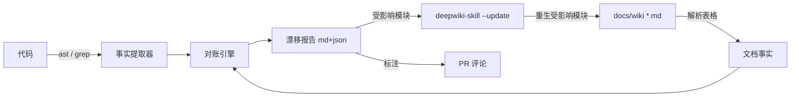

# 漂移检测设计:让文档与代码自动对账

> 配套文档:`docs/RepoWiki增量同步方案.md`。本篇聚焦"漂移检测"这一层的设计与落地。

## 1. 这是什么(一句话)

**漂移检测 = 自动比对"文档声称的"和"代码实际的",找出不一致。**

举几个本项目会遇到的:
- 文档端点表列了 15 个 API,代码 `routers/` 里实际 18 个 → 3 个未记录
- 文档定价表写 Pro 每日 100 次,`constants.ts` 已改成 120 → 文档过时
- `manifest.json` 新增了 host_permissions,文档"运行范围"没提

**关键区分**:这不是"重新生成文档"(那是 deepwiki-skill / repowiki 干的),而是"检测文档哪里烂了"。类比——
- deepwiki-skill = **编译器**(生成)
- 漂移检测 = **linter / type-checker**(只校验,不生成)

**为什么需要**:文档腐化是无声的。新人按过时文档操作出错、API 契约和文档不符导致集成方投诉、合规审计发现文档与实现脱节。生成工具解决"从无到有",但解决不了"已有文档慢慢过时"——尤其文档被人工编辑过、或代码改了没同步。这正是 repowiki / deepwiki-skill / 通义灵码 **都没做** 的缺口。

## 2. 两层策略

| 层 | 方法 | 成本 | 覆盖 |
|----|------|------|------|
| **确定性事实层** | grep / AST 提取硬事实,逐项对账 | 低、零幻觉 | ~90% 漂移 |
| **语义层** | LLM 判断 Mermaid 图/流程叙述是否成立 | 高 | 剩余难量化的 |

先用确定性层筛掉 90%(端点数、定价数字、表字段这些"硬"漂移),只剩对不上的少数再请 LLM 查语义(图是否还成立)。**不要一上来就让 LLM 读全文档比对全代码**——既贵又会幻觉。

## 3. 事实提取器

### 3.1 后端事实提取器(FastAPI)

最稳的方式是 **Python `ast` 扫 `routers/`**(无副作用,不用启动应用/连 DB):

```python
import ast, pathlib

def extract_endpoints(router_file: str):
    tree = ast.parse(pathlib.Path(router_file).read_text())
    eps = []
    for node in ast.walk(tree):
        if (isinstance(node, ast.Call)
                and isinstance(node.func, ast.Attribute)
                and node.func.attr in {"get","post","put","delete","patch"}):
            method = node.func.attr.upper()
            path = ast.literal_eval(node.args[0]) if node.args else ""
            eps.append({"method": method, "path": path, "line": node.lineno})
    return eps
```

> 进阶:`import app` 直接读 `app.routes` 拿真实路由表(含动态路由解析结果),但需要能 import(依赖、DB 连接)。MVP 用 `ast` 更稳。

本项目后端要对账的事实(`bossbot/backend/app/`):
- **端点**:`routers/{auth,extension_auth,subscription,webhook,quota,orders}.py` 的 method+path
- **模型**:`models/` 的表名+字段(User / Order / Subscription 等)
- **配置**:`config.py` 的 Settings 键名(脱敏对账,不碰值)

### 3.2 扩展事实提取器

- **manifest.json**:直接 `JSON.parse` 读 `host_permissions`、`permissions`、`content_scripts.matches`、`background.service_worker`
- **constants.ts 订阅档位**:TS AST 最准;MVP 用 grep 也够:

```python
import re
text = open("bossbot/extension/src/shared/constants.ts").read()
# 粗提取 tier → 每日限额
for m in re.finditer(r'(\w+).*?daily(?:Limit|limit)["\s:=]+(\d+)', text):
    tier, limit = m.group(1), int(m.group(2))
```

本项目扩展要对账的事实:
- **订阅档位**:Free=30 / Pro=100 / Ultimate=150(每日限额)→ 对账文档定价表
- **manifest host**:zhipin.com 相关 → 对账文档"运行范围"

## 4. 对账引擎

**输入**:代码事实(JSON)+ 文档事实(解析 `docs/wiki/*.md` 里的表格)
**比对**:集合差集 / 数字比对
**输出**:漂移报告,双格式——

Markdown(人读):
```markdown
## 漂移报告 2026-06-13
### 🔴 API 端点漂移
- 文档端点表列 15 个,代码实际 18 个
- 未记录:POST /api/orders/create、GET /api/quota/usage、DELETE /api/subscription/cancel
### 🟡 定价漂移
- Pro 每日限额:文档写 100,constants.ts 实际 120
```

JSON(机读,CI 用):
```json
{"drifts":[
  {"type":"endpoint","severity":"high","doc_count":15,"code_count":18,
   "missing":["POST /api/orders/create","GET /api/quota/usage"]},
  {"type":"pricing","severity":"mid","tier":"pro","doc":100,"code":120}
]}
```

## 5. 与 deepwiki-skill 协同(检测器 + 修复器)

漂移检测**只报告,不重写**。修文档交给 deepwiki-skill `--update`:

1. 漂移检测输出"受影响模块"(端点漂移→`backend-api.md`,定价漂移→`pricing.md`)
2. 触发 `deepwiki-skill:gen docs/wiki/toc.yaml --update` 只重生这些模块
3. 重生后重算漂移,清零

## 6. CI 集成

推荐 **PR 评论标注漂移**(不阻断、不自动改主分支):

- PR 改了 `backend/routers/` → CI 跑漂移检测 → PR 评论贴漂移项
- 不自动改文档(文档改动值得人 review)
- 漂移超阈值才评论,避免噪音

## 7. 落地步骤

1. **P0**:后端端点提取器 + 对账 + Markdown 报告(单 Python 脚本,先跑通)
2. **P1**:加扩展事实(manifest / constants)+ JSON 输出
3. **P2**:CI 集成(GitHub Action + PR 评论)
4. **P3**:语义层(Mermaid / 叙述漂移)+ 多框架

## 架构图


